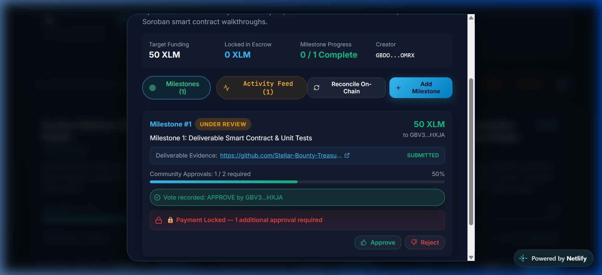
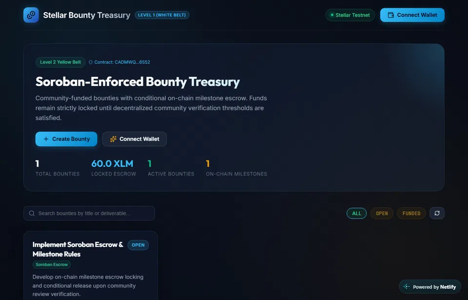

# 📜 Stellar Bounty Treasury — Smart Contracts

Authoritative Soroban smart contract repository for **Stellar Bounty Treasury**, enforcing on-chain bounty funding escrow, milestone lifecycle management, community verification quorums, and conditional payment release.

**🌐 Live Frontend Application**: [https://stellar-bounty-treasury-2676.netlify.app](https://stellar-bounty-treasury-2676.netlify.app)

---

## 📌 What It Does

At **Level 2 (Yellow Belt)**, the smart contract is the authoritative financial and state machine layer:

$$\text{The contract enforces. The backend observes. The frontend orchestrates.}$$

* **On-Chain Escrow Vault**: User contributions are transferred directly to the contract account address rather than the creator's wallet. Funds cannot be withdrawn or drained without meeting milestone criteria.
* **On-Chain Milestones**: Milestones are stored with specific reward allocations, designated recipient addresses, and verification approval thresholds.
* **Milestone Submission**: Designated contributors submit off-chain evidence references (e.g. GitHub PR URLs, commit hashes, or CIDs).
* **Community Verification**: Eligible community reviewers cast cryptographic votes (`Approve` or `Reject`). The contract strictly enforces single-vote-per-reviewer replay prevention.
* **Conditional Payment Release**: Settlement is rejected until the milestone's approval threshold is reached on-chain. Once approved, the contract authoritatively disburses the exact allocated reward to the contributor.
* **Structured Events**: The contract emits structured events (`bounty_created`, `bounty_funded`, `milestone_created`, `milestone_submitted`, `milestone_approved`, `milestone_paid`) for backend indexing.

---

## 🌐 Testnet Deployment

| Parameter | Value |
| :--- | :--- |
| **Network** | **Stellar Testnet** (`Test SDF Network ; September 2015`) |
| **Contract ID** | **[`CADMWQPCCQP27UHQU4JG3C6V5I3UFNNC4DVOMSK2GUJFA6Q2PNW36S52`](https://stellar.expert/explorer/testnet/contract/CADMWQPCCQP27UHQU4JG3C6V5I3UFNNC4DVOMSK2GUJFA6Q2PNW36S52)** |
| **Deployer Address** | `GD6DQE75KKO6Y3SA76IXGQH2GFFUULPUTQUQ3LXIPRDJ66K2UUGDF2DN` |
| **WASM Upload Hash** | `9fb1729caeb1772db3a31c5d32bc5ff11fe68afd0705643bc8cfcbe8d52165b0` |
| **Contract Creation Hash** | `104780990d357ac1be516bf648971c899982f3ec9b248ca0a2bc82f13d084ccc` |
| **Initialization Hash** | `0fcb3ec79bac12048b0380d5b2887c8ff312bd66e9e55f19b09b76ad3a9dc330` |

---

## 🏛️ Contract Interface & Methods

```rust
// Contract Initialization
pub fn initialize(env: Env, admin: Address);
pub fn get_admin(env: Env) -> Address;
pub fn get_bounty_count(env: Env) -> u64;

// 1. Bounty Creation
pub fn create_bounty(env: Env, creator: Address, title: Symbol, target_amount: i128, token: Address) -> u64;

// 2. Bounty Escrow Funding
pub fn fund_bounty(env: Env, funder: Address, bounty_id: u64, amount: i128);

// 3. Milestone Creation
pub fn create_milestone(env: Env, creator: Address, bounty_id: u64, description: Symbol, reward_amount: i128, recipient: Address, approval_threshold: u32) -> u32;

// 4. Milestone Submission
pub fn submit_milestone(env: Env, caller: Address, bounty_id: u64, milestone_id: u32, submission_ref: Symbol);

// 5. Community Verification (Approve / Reject)
pub fn verify_milestone(env: Env, reviewer: Address, bounty_id: u64, milestone_id: u32, decision: VoteDecision);

// 6. Conditional Payment Release
pub fn release_milestone_payment(env: Env, caller: Address, bounty_id: u64, milestone_id: u32);

// Queries
pub fn get_bounty(env: Env, bounty_id: u64) -> Bounty;
pub fn get_milestone(env: Env, bounty_id: u64, milestone_id: u32) -> Milestone;
pub fn has_voted(env: Env, bounty_id: u64, milestone_id: u32, reviewer: Address) -> bool;
```

---

## 🚀 How to Run It

### Prerequisites

* Rust 1.80+ (`rustup target add wasm32-unknown-unknown`)
* Soroban SDK `v22.0.11`
* Node.js 20+ (for deployment scripts)

### Running Unit Tests

Execute the comprehensive Level 2 test suite locally:

```bash
cargo test
```

### Building the WASM Artifact

Compile the contract to WebAssembly target:

```bash
cargo build --target wasm32-unknown-unknown --release
npx wasm-opt -Oz --strip-debug --disable-reference-types -o target/wasm32-unknown-unknown/release/stellar_bounty_contracts.wasm target/wasm32-unknown-unknown/release/stellar_bounty_contracts.wasm
```

### Deploying to Stellar Testnet

```bash
node scripts/deploy.cjs
```

---

## ⚙️ Required Environment Variables

For deployment and RPC queries:
* `STELLAR_NETWORK=testnet`
* `SOROBAN_RPC_URL=https://soroban-testnet.stellar.org`
* `DEPLOYER_SECRET_KEY=S...` (for deploying new contract instances)

---

## 👛 How to Connect a Stellar Testnet Wallet

Callers interact with the contract using their Stellar public keys:
1. When invoking state-mutating functions (`fund_bounty`, `submit_milestone`, `verify_milestone`, `release_milestone_payment`), Soroban requires caller cryptographic authorization (`caller.require_auth()`).
2. In browser environments, users sign invocations using **Freighter Wallet** or imported Testnet signers.
3. In local unit tests, simulated callers and auth mocks are handled via `env.mock_all_auths()`.

---

## 📝 How to Create a Bounty

At the contract layer, invoke `create_bounty`:

```rust
let bounty_id = client.create_bounty(&creator, &title, &target_amount, &token_address);
```

* Authenticated by `creator.require_auth()`.
* Generates a sequential, auto-incrementing ID.
* Emits a `(bounty, created)` event.

---

## 💸 How to Fund a Bounty

Funding transacts native tokens into the contract's escrow address:

```rust
client.fund_bounty(&funder, &bounty_id, &amount);
```

* Authenticated by `funder.require_auth()`.
* Invokes `token::Client::transfer(&funder, &contract_address, &amount)`.
* Updates on-chain funded balance and transitions status to `Funded` when target is reached.

---

## 🔍 How to Verify a Transaction

1. In Soroban contracts, all state mutations emit structured events via `env.events().publish(...)`.
2. On Testnet, contract invocations are queried using Soroban RPC `getTransaction` by transaction hash.
3. Contract state can be directly verified on [Stellar.Expert Testnet Contract Explorer](https://stellar.expert/explorer/testnet/contract/CADMWQPCCQP27UHQU4JG3C6V5I3UFNNC4DVOMSK2GUJFA6Q2PNW36S52).

---

## 🔄 How the Repository Will Evolve in Level 3

```text
LEVEL 2 (Current)
  On-chain Escrow Vault ➔ Milestone Submissions ➔ Community Quorum Verification ➔ Single-Recipient Conditional Release

LEVEL 3 (Future)
  Multi-recipient Settlement ➔ Settlement Router ➔ Realtime Contract Event Streaming ➔ Autonomous DAO Arbitration
```

---

## 🧪 Test Suite Coverage

The test suite covers:
1. `test_initialize_and_create_bounty`: Initializes contract, sets admin, and creates bounty.
2. `test_fund_bounty_escrow`: Transfers tokens to contract escrow and validates contract balance.
3. `test_end_to_end_milestone_verification_and_settlement`: Verifies complete lifecycle: creation -> funding -> milestone creation -> contributor submission -> 2 reviewers approve -> conditional release executes -> contributor balance increases.
4. `test_duplicate_reviewer_vote_fails`: Asserts panic when a reviewer attempts to vote twice on the same milestone.
5. `test_payment_release_fails_if_not_approved`: Asserts that attempting payment release before reaching threshold fails.
6. `test_unauthorized_contributor_submission_fails`: Asserts that an unauthorized caller cannot submit a milestone assigned to someone else.
7. `test_non_creator_cannot_add_milestones`: Asserts that non-creators cannot create milestones on a bounty.

---

## 📸 Level 2 Evidence & Demonstration

### 1. Level 2 On-Chain Bounty Dashboard & Soroban Escrow
The dashboard displays bounties with live milestone progress indicators (`1 / 1 complete`), locked Soroban contract escrow balances, and direct links to the deployed contract on Stellar Expert (`CADMWQPCCQP27UHQU4JG3C6V5I3UFNNC4DVOMSK2GUJFA6Q2PNW36S52`).


### 2. Milestone Deliverable Review & Community Approval
Demonstrating the live deliverable submission (`pull/2`), reviewer voting interface, and approval quorum verification directly recorded on-chain.



### 3. Live Demo Video: Milestone Voting & Conditional Release
Demonstrating the full Level 2 lifecycle: wallet connection, bounty creation, milestone submission with deliverable PR, multi-wallet community verification, threshold satisfaction, conditional payment unlock, and contract activity indexing.



---

## 📄 License

MIT
